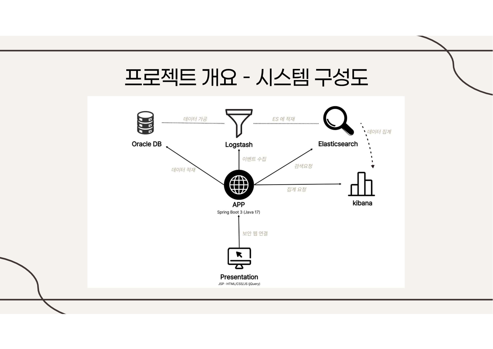
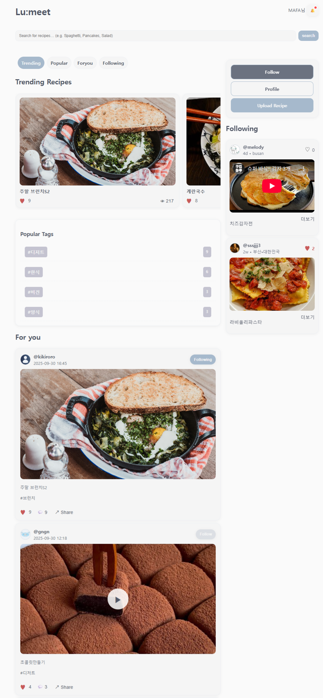
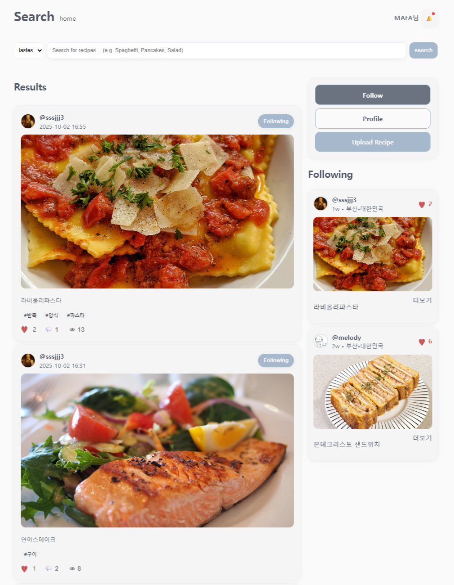
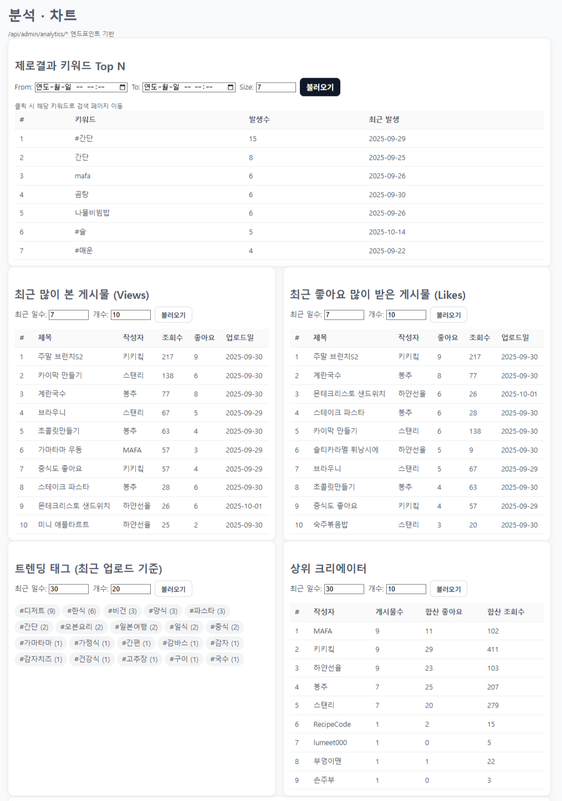

# 🌐 프로젝트 이름
Lumeat (루밋) : Luminous + Eat, 빛나는 한 끼


---

## 📖 목차
1. [프로젝트 소개](#-프로젝트-소개)
2. [기술 스택](#-기술-스택)
3. [주요 기능](#-주요-기능)
4. [시스템 구조](#-시스템-구조)
5. [화면 구성](#-화면-구성)
6. [설치 및 실행](#-설치-및-실행)
7. [ERD 및 API 명세](#-erd-및-api-명세)
8. [팀 소개](#-팀-소개)
9. [라이선스](#-라이선스)

---

## 🚀 프로젝트 소개
- 서비스 목적 : 사용자에 맟춰 개인화한 요리 레시피 sns 제공
- 주요 사용자층 : sns를 자주사용하고 요리를 좋아하는 사람들! 
- 개발 기간  : 2025.09.10 ~ 2025.10.20
- 핵심 가치 또는 슬로건  : 빛나고 맛나는 한끼


 “RecipeCode”는 레시피를 공유하고 추천받는 **SNS형 요리 플랫폼**입니다.  
 사용자 간의 교류와 개인화된 피드를 통해 나만의 요리 인사이트를 얻을 수 있습니다.

---

## ⚙️ 기술 스택

### 🖥️ Frontend
- JSP / HTML / CSS / JavaScript (jQuery)
- Chart.js / AJAX / Responsive Design

### 🧩 Backend
- Spring Boot 3.4.9 (Java 17)
- Spring Security / JWT / JPA / QueryDSL

### 🗄️ Database & Search
- Oracle XE / SE
- Elasticsearch 8.14 / Logstash / Kibana

### 🧠 AI & Data
- Python (추천 시스템, 집계 스크립트)

### ☁️ Infra & Tools
-  RDS
- Git / GitHub / Notion / Figma / Postman

---

## ✨ 주요 기능
| 구분 | 기능 | 설명 |
|------|------|------|
| 회원 | 로그인 / 회원가입 / 마이페이지 | 세션 및 JWT 기반 인증 |
| 레시피 | CRUD / 이미지 업로드 | 작성자, 태그, 카테고리 관리 |
| 검색 | 통합검색 / 태그검색 / 사용자검색 | Elasticsearch 기반 |
| 추천 | 개인화 피드 / 트렌딩 | Python + ES 기반 |
| 알림 | 댓글, 좋아요, 팔로우 | 실시간 반영 및 UI 표시 |
| 관리자 | 신고 처리 / 트래픽 집계 | Kibana 대시보드 연동 |

---

## 🏗️ 시스템 구조


  |


## 🖼️ 화면 구성
| 페이지 | 설명 | 예시 |
|---------|------|------|
| 메인 피드 | 트렌딩 & 추천 게시물 |  |
| 검색 페이지 | 통합검색 / 정렬 탭 |  |
| 관리자 페이지 | 통계, 신고 관리 |  |

---

## 💻 설치 및 실행

### 1️⃣ Clone Repository
```bash
git clone https://github.com/yourname/project.git
cd project


2️⃣ Build & Run
./gradlew build
java -jar build/libs/project.jar

3️⃣ Access
http://localhost:8080


---
##🧩 ERD 및 API 명세

### ERD 문서 보기

### API 명세서(Swagger)


---
## 👥 팀 소개

